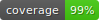

# UTMOS



Maximum-coverage algorithm to select samples for validation and resequencing.
This is a reimplementation of [SVCollector](https://github.com/fritzsedlazeck/SVCollector)

SVCollector is a tool for solving the maximum-coverage problem for sample selection. Utmos is a python re-write of that code
which leverages scikit-allel, numpy, and joblib. Utmos is designed for extremely large cohorts by allowing subsets of
variants to be parsed and stored as small(ish) intermediate files before concatenating during the selection step.

## Install

Download a [release](https://github.com/ACEnglish/utmos/releases) and run
```
python3 -m pip install Utmos-<version>.tar.gz
```

Alternative, build from the repository, 
```bash
git clone https://github.com/ACEnglish/utmos.git
cd utmos/
python3 -m pip install . 
```

## Quick Start

```bash
utmos select input1.vcf
```

See `--help` of commands for more details.

## Output format

Tab-delimited file of:

<table><tr><th>Column</th><th>Description</th>
<tr><td>sample</td><td>Sample name</td></tr>
<tr><td>var_count</td><td>Number of variants in the sample</td></tr>
<tr><td>new_count</td><td>Number of new variants contributed by the sample</td></tr>
<tr><td>tot_captured</td><td>Running total of number of variants captured by all samples upto this point</td></tr>
<tr><td>pct_captured</td><td>Percent of all variants captured by samples upto this point</td></tr>
</table>

## utmos convert

Pulls information from `vcf[.gz]` into numpy arrays and saves using joblib.
This step is optional, but makes it easier to convert multiple VCFs at once (with separate jobs).
As a test, the genotype-only chr22 snps from the 1kgp is 196M while the utmos converted file is 64M.

If `utmos select --af` is going to be run, you must use `utmos convert --af`

```
utmos convert [-h] [--lowmem] [-c COMPRESS] [--af] in_file out_file
```

VCFs can be pre-filtered and piped into convert e.g.:
```
bcftools view -i "AF >= 0.01" input.vcf.gz | utmos convert /dev/stdin output.jl
```

## utmos select

Select samples for validation and resequencing. Uses a greedy approach where it chooses the sample with the most
unseen variants after each iteration. 

```
utmos select [-h] [--lowmem] [-o OUT] [-c COUNT] [--af] [--weights WEIGHTS]
             [--include INCLUDE] [--exclude EXCLUDE]
             in_files [in_files ...]
```

* `--count` sets how many samples are selected. Can be a count or a percent of samples if < 1 
* `--af` will weigh the variants by their allele frequency, which helps reduce bias towards rare/private alleles.
* `--weight` is a tab-delimited file of samples and a weight. Not every sample in the vcf needs to be given a 
score in the weight file. Any sample without a provided weight is given a 1. 
* `--include` and `--exclude` will force inclusion or exclusion of samples regardless of their score. These 
parameters can take a comma-separated list of sample names (e.g. samp1,samp2) or can point to a file with one sample per-line. 
* `in_files` are one or more input files and can be a mix of vcfs or jl files from `utmos convert`. 


Future features:
* `--mode` : greedy (default), random, topN 

## Performace metrics
Running on a 2013 Mac Pro and using chr22 from 1kgp genotype  
`ftp://ftp.1000genomes.ebi.ac.uk/vol1/ftp/release/20130502//ALL.chr22.phase3_shapeit2_mvncall_integrated_v5b.20130502.genotypes.vcf.gz`

2,504 samples x 1,103,547 variants

Utmos runtime:
```
real	24m26.507s
user	11m37.160s
sys	5m12.713s
```

SVCollector runtime: (including 30 seconds to uncompress the VCF)
```
real	61m34.008s
user	49m28.622s
sys	1m24.693s
```

On newer hardware (Intel(R) Xeon(R) CPU E5-2670 v3 @ 2.30GHz) and running the docker through singularity:
```
#Utmos:
real	7m48.177s
user	6m53.104s
sys	0m53.056s
```

## Dockerfile

A Dockerfile exists to build an image of utmos. To make a Docker image, clone the repository and run
```bash
docker build -t utmos .
```

You can then run utmos through docker using
```bash
docker run -v `pwd`:/data -it utmos
```
Where `pwd` can be whatever directory you'd like to mount in the docker to the path `/data/`, which is the working
directory for the utmos run. You can provide parameters directly to the entry point.
```bash
docker run -v `pwd`:/data -it utmos convert example.vcf.gz example.jl
```

