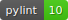

# UTMOS



Maximum-coverage algorithm to select samples for validation and resequencing.
This is a reimplementation of [SVCollector](https://github.com/fritzsedlazeck/SVCollector)

SVCollector is a tool for solving the maximum-coverage problem for sample selection. Utmos is a python re-write of that code
which leverages scikit-allel, numpy, and joblib. Utmos is designed for extremely large cohorts by allowing subsets of
variants to be parsed and stored as small(ish) intermediate files before concatenating during the selection step.

## Install

Download a [release](https://github.com/ACEnglish/utmos/releases) and run
```
python3 -m pip install Utmos-<version>.tar.gz
```

Alternatively, build from the repository, 
```bash
git clone https://github.com/ACEnglish/utmos.git
cd utmos/
python3 -m pip install . 
```

## Quick Start

```bash
utmos select input1.vcf > sample_report.txt
```

See `--help` of commands for more details.

## Output format

Tab-delimited file of:

<table><tr><th>Column</th><th>Description</th>
<tr><td>sample</td><td>Sample name</td></tr>
<tr><td>var_count</td><td>Number of variants in the sample</td></tr>
<tr><td>new_count</td><td>Number of new variants contributed by the sample</td></tr>
<tr><td>tot_captured</td><td>Running total of number of variants captured by all samples upto this point</td></tr>
<tr><td>pct_captured</td><td>Percent of all variants captured by samples upto this point</td></tr>
</table>

## utmos convert

Pulls genotype presence/absence information from `vcf[.gz]` into numpy arrays, calcluates allele frequencies
and saves using joblib. This step is optional, but makes it easier to convert multiple VCFs at once
(with separate jobs). The genotype array is shrunk using `numpy.packbits` and joblib compression can reduce file size
even further.  
As a test, the genotype-only chr22 snps from the 1kgp (2,504 samples x 1,103,547 variants)
<table><tr><th>File</th><th>Size (megabytes)</th><th>Fold Decrease</th>
<tr><td>VCF</td><td>198</td><td>.</td></tr>
<tr><td>without packbits</td><td>64</td><td>3.09</td></tr>
<tr><td>with packbits</td><td>29</td><td>6.82</td></tr>
<tr><td>--compress 9</td><td>26</td><td>7.62</td></tr>
<tr><td>both axis pack*</td><td>12</td><td>16.5</td></tr>
<tr><td>both axis pack* -c 9 </td><td>11</td><td>18</td></tr>
</table>

\* both axis pack is not yet implemented since the overhead it requires slows runtime a little bit. I'll implement it if there's any demand

```
utmos convert [-h] [--lowmem] [-C CHUNK_LENGTH] [-c COMPRESS]
              in_file out_file
```
* `--lowmem` lowers memory usage if the input file is a vcf[.gz] by converting directly into an intermediate hdf5 file.
* `--chunk_length` is an integer pased to scikit-allele during conversion and represents how many variants are parsed at
  once. The default value is probably fine for most use cases, but performance can be tested. Generally, VCFs with 
  extremely high sample counts (100k+) should have a smaller chunk_length (the default). VCFs without many samples or
  with high amounts of memory available can use a higher chunk_length in an attempt to speed up conversion.
* `--compress` compression level performed by joblib between 0 (lowest compression, fastest IO) and 10 (high
  compression, slower IO)
* `in_file` an input vcf[.gz]
* `out_file` an output .jl file

VCFs can be pre-filtered and piped into convert e.g.:
```
bcftools view -i "AF >= 0.01" input.vcf.gz | utmos convert /dev/stdin output.jl
```

## utmos select

Select samples for validation and resequencing.
Works by iteratively selecting samples based on a score and reporting how many variants the sample contains as well as
how many unseen variants contributed by the sample. Scores by default are variant counts which can then be weighted with
`--weights` and/or `--af`

```
utmos select [-h] [--lowmem] [-o OUT] [--concat CONCAT]
             [-m {greedy,topN,random}] [-c COUNT] [--af] [--weights WEIGHTS]
             [--subset SUBSET] [--include INCLUDE] [--exclude EXCLUDE]
             [--debug]
             in_files [in_files ...]
```

* `--count` sets how many samples are selected. Can be a count or a percent of samples if < 1 
* `--af` will weigh the variants by their allele frequency, which helps reduce bias towards rare/private alleles.
* `--weight` is a tab-delimited file of samples and a weight. Not every sample in the vcf needs to be given a 
score in the weight file. Any sample without a provided weight is given a 1. 
* `--include` and `--exclude` will force inclusion or exclusion of samples regardless of their score. These 
parameters can take a comma-separated list of sample names (e.g. samp1,samp2) or can point to a file with one sample per-line. 
* `--subset` will restrict analysis to only the specified samples before beginning any processing.
* `in_files` are one or more input files and can be a mix of vcf[.gz] or jl files from `utmos convert`. 
* `--mode` :
  * greedy (default): On each iteration, pick the sample with highest score and remove its variants from future iterations
  * topN: Sort samples by score, return the highest scoring samples
  * random: Pick random samples
* `--concat` lowers memory usage during concatenation of input files by writing each input into an hdf5 file. 
  Without `--concat`, the entire dataset must be held in memory twice momentarily to do the concatenation (once 
  with the pieces and once with the full dataset). The hdf5 file to which the input files are written can be 
  reused directly in future `select` runs.
* `--lowmem` lowers memory usage if the input file is a vcf[.gz] by converting directly into an hdf5 file. This is just
  a hook in to `utmos convert --lowmem`

## Performace metrics
Running on a 2013 Mac Pro and using chr22 from 1kgp genotype  
`ftp://ftp.1000genomes.ebi.ac.uk/vol1/ftp/release/20130502//ALL.chr22.phase3_shapeit2_mvncall_integrated_v5b.20130502.genotypes.vcf.gz`

2,504 samples x 1,103,547 variants

Utmos runtime:
```
real	24m26.507s
user	11m37.160s
sys	5m12.713s
```

SVCollector runtime: (including 30 seconds to uncompress the VCF)
```
real	61m34.008s
user	49m28.622s
sys	1m24.693s
```

On newer hardware (Intel(R) Xeon(R) CPU E5-2670 v3 @ 2.30GHz) and running the docker through singularity:
```
#Utmos
real	6m30.870s
user	5m53.305s
sys	0m36.403s

#SVCollector
real	7m44.110s
user	7m8.516s
sys	0m17.368s
```

## Dockerfile

A Dockerfile exists to build an image of utmos. To make a Docker image, clone the repository and run
```bash
docker build -t utmos .
```

You can then run utmos through docker using
```bash
docker run -v `pwd`:/data -it utmos
```
Where `pwd` can be whatever directory you'd like to mount in the docker to the path `/data/`, which is the working
directory for the utmos run. You can provide parameters directly to the entry point.
```bash
docker run -v `pwd`:/data -it utmos convert example.vcf.gz example.jl
```

